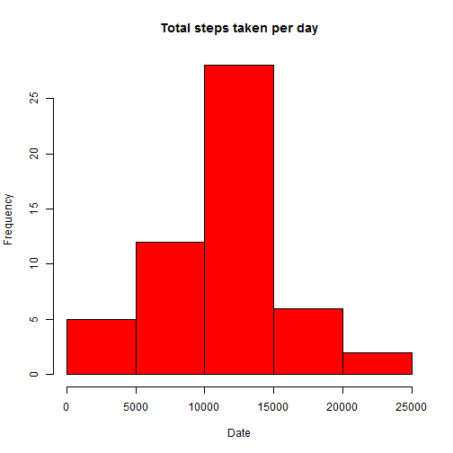
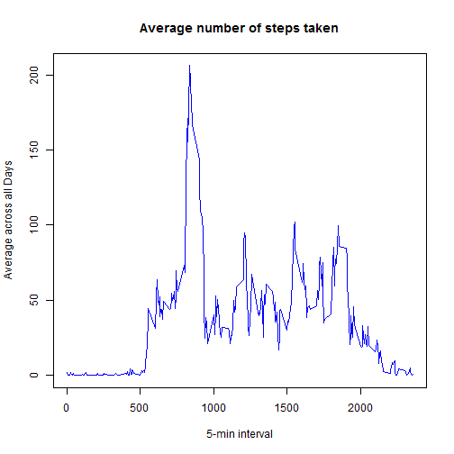
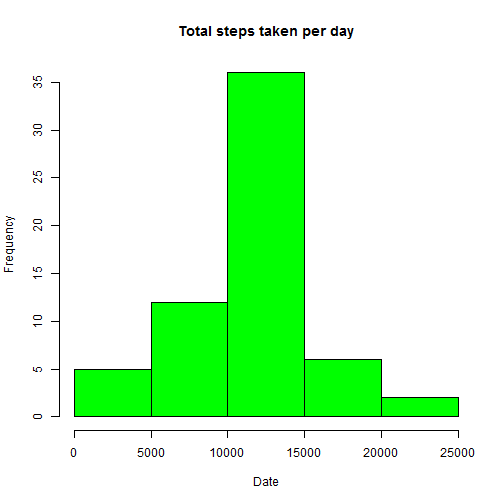
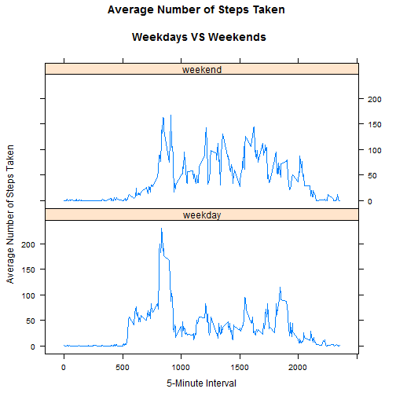

#Peer Assessment 1

+++++++++++++++++++++++++++++++++++++++++  
TITLE: "PA1_template.Rmd"  
AUTHOR: "Nitish K Bugalia"  
DATE: "Saturday, August 8, 2015"  
OUTPUT: html_document  
DESCRIPTION: This is R Markdown file for Peer Assessment 1 of Reproducible Research course at Coursera.  
+++++++++++++++++++++++++++++++++++++++++  


Set the R code to be visible.

```r
echo = TRUE 
```


###Load the Data
Read data from the csv (unzipped) into a frame. Set the working directory to where the csv is located.

```r
activity <- read.csv("activity.csv", colClasses = c("numeric", "character", "numeric"))
head(activity)
```

```
##   steps       date interval
## 1    NA 2012-10-01        0
## 2    NA 2012-10-01        5
## 3    NA 2012-10-01       10
## 4    NA 2012-10-01       15
## 5    NA 2012-10-01       20
## 6    NA 2012-10-01       25
```

```r
#convert date data type
activity$date <- as.Date(activity$date) 
```

###What is mean total number of steps taken per day?

####Total Steps per day

```r
tSteps <- aggregate(steps ~ date, data = activity, sum, na.rm = TRUE)
head(tSteps)
```

```
##         date steps
## 1 2012-10-02   126
## 2 2012-10-03 11352
## 3 2012-10-04 12116
## 4 2012-10-05 13294
## 5 2012-10-06 15420
## 6 2012-10-07 11015
```


####Mean, Median and Histogram
Calculate the Mean and Median for steps per day, then plot the histogram for steps taken per day.

```r
#Mean
mean(tSteps$steps)
```

```
## [1] 10766.19
```

```r
#Median
median(tSteps$steps)
```

```
## [1] 10765
```

```r
#Histogram
hist(tSteps$steps, main = "Total steps taken per day", xlab = "Date", col = "Red")
```

 

###What is the average daily activity pattern?

####Time Series Plot
Make a time series plot (i.e. type = "1") of the 5-minute interval (x-axis) and the average number of steps taken, averaged across all days (y-axis).

```r
avg <- aggregate(x = list(steps = activity$steps), by=list(interval = activity$interval),
    FUN = mean, na.rm = TRUE)
plot(avg$steps~avg$interval, type="l", xlab = "5-min interval", ylab = "Average across all Days", 
    main = "Average number of steps taken", col = "Blue")
```

 

####Max 5 min interval
Which 5-minute interval, on average across all the days in the dataset, contains the maximum number of steps?

```r
avg[which.max(avg$steps), ]
```

```
##     interval    steps
## 104      835 206.1698
```

###Imputing missing values

Calculate and report the total number of missing values in the dataset.

```r
act_NA <- sum(is.na(activity))
act_NA
```

```
## [1] 2304
```


Impute the missing values with avergae of that interval for all days, from the previous average dateset used for time-series plot for 5-minute intervals.

```r
activity_imp <- transform(activity, steps = ifelse(is.na(activity$steps), avg$steps[match(activity$interval, avg$interval)], activity$steps))

#Checking for NA values in imputed data, result should be zero.
sum(is.na(activity_imp))
```

```
## [1] 0
```

#####Total Steps per day for imputed dataset

```r
tSteps2 <- aggregate(steps ~ date, data = activity_imp, sum, na.rm = TRUE)
head(tSteps2)
```

```
##         date    steps
## 1 2012-10-01 10766.19
## 2 2012-10-02   126.00
## 3 2012-10-03 11352.00
## 4 2012-10-04 12116.00
## 5 2012-10-05 13294.00
## 6 2012-10-06 15420.00
```

#####Mean, Median and Histogram for imputed dataset
Calculate the Mean and Median for steps per day, then plot the histogram for steps taken per day.

```r
#Mean
mean(tSteps2$steps)
```

```
## [1] 10766.19
```

```r
#Median
median(tSteps2$steps)
```

```
## [1] 10766.19
```

```r
#Histogram
hist(tSteps2$steps, main = "Total steps taken per day", xlab = "Date", col = "Green")
```

 

As we can see from comparing the results for Mean and Median between imputed and non imputed data, the difference is not too significant. Mean still remains the same, however median has changed by just a little bit. On the histogram however, we can see the frequency has changed significantly after imputing the data.

###Are there differences in activity patterns between weekdays and weekends?
Imputed dataset has been used for this part of the analysis.
Create a new factor variable in the dataset with two levels - "weekday" and "weekend" indicating whether a given date is a weekday or weekend day.

```r
activity_imp$DayType <- factor(ifelse(weekdays(activity_imp$date) %in% 
                c("Saturday","Sunday"),"weekend", "weekday"))
head(activity_imp)
```

```
##       steps       date interval DayType
## 1 1.7169811 2012-10-01        0 weekday
## 2 0.3396226 2012-10-01        5 weekday
## 3 0.1320755 2012-10-01       10 weekday
## 4 0.1509434 2012-10-01       15 weekday
## 5 0.0754717 2012-10-01       20 weekday
## 6 2.0943396 2012-10-01       25 weekday
```

Make a panel plot containing a time series plot (i.e. type = "1") of the 5-minute interval (x-axis) and the average number of steps taken, averaged across all weekday days or weekend days (y-axis).


```r
avgDayType <- aggregate(steps ~ interval + DayType, data=activity_imp, FUN = mean, na.rm = TRUE)
library("lattice")
xyplot(steps ~ interval | factor(DayType), data=avgDayType, 
       type = "l",main="Average Number of Steps Taken 
       \n Weekdays VS Weekends", layout = c(1, 2),
       xlab="5-Minute Interval",
       ylab="Average Number of Steps Taken")
```

 

The plot clearly shows difference in activity over the weekends and weekdays. People tend to be more active on weekends than weekdays, which is in contrast to my behavior for sure. :)
